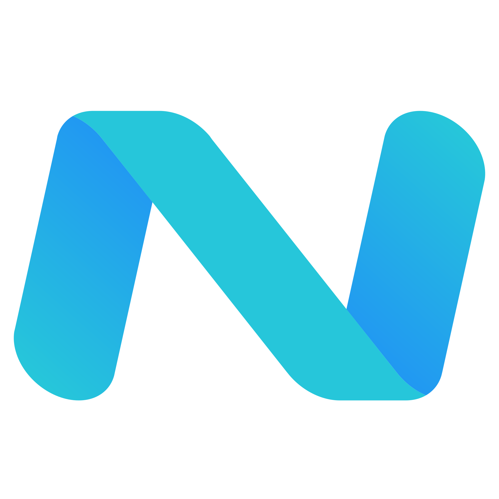
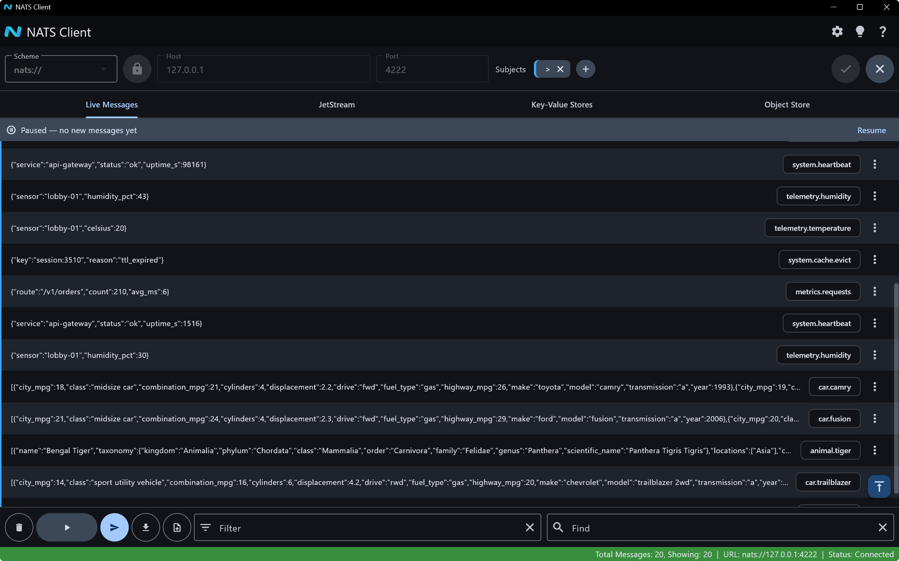
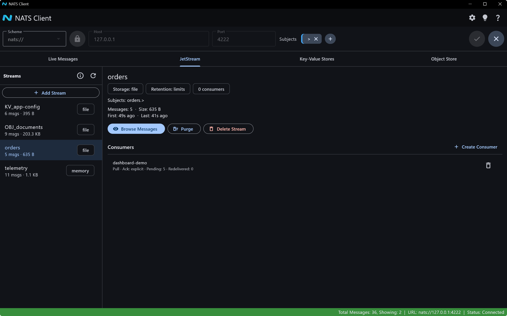

#  NATS Client UI
[](https://github.com/nverbeek/nats_client_flutter/actions/workflows/build.yml)

This NATS client is a cross-platform desktop & web application written in Flutter. The client allows users to easily watch & manage NATS messages.

# Platforms
This application currently supports Windows, Linux, macOS and Web platforms. 

# Main Features
- Connect to a single NATS server using either plain (`nats://`) or WebSocket (`ws://`) schemes
- TLS connection support with optional custom certificates
- **Authentication support**: username/password, bearer token, NKey seed, or decentralized JWT+NKey (`.creds` file) — configured in the same Security Settings dialog as TLS, with credentials remembered only if you opt in
- Subscribe to multiple subjects, each with its own auto-assigned color shown on its chip and matching Live Messages rows, so it's easy to tell at a glance which subscription a message came from — toggle it off in Settings ("Show Subscription Colors", on by default) if you'd rather not see them
- Automatic re-connect upon lost connection
- **Connection history**: the Host field remembers up to 10 previously-used `scheme://host:port` targets, offered in a searchable dropdown as you type — pick one to fill in the scheme, host, and port at once, or delete individual entries / clear the whole history from the same dropdown. Only successful connections are remembered, so typos and unreachable hosts don't clutter the list.
- Filter received messages
- Find text in received messages
- Pause the message list to freeze it while you work, without stopping arrivals in the background
- Multi-select messages (Shift+Click, Ctrl+Click, Ctrl+Shift+Up/Down for a range or disconnected set) and copy them to the clipboard as plain text
- **Export & Replay**: bulk-export captured messages (a selection, or everything captured) to an NDJSON file — with a warning if the export is large — then **Replay** a previously exported file by publishing every message back onto the connected server, with configurable pacing (delay between messages, repeat count, delay between repeats) and a live progress banner with a Stop button
- Send custom messages
- See message details, such as headers, subject and payload. JSON payloads are automatically formatted and syntax highlighted as well!
- Light and Dark themes
- Most recent connection information & theme are persisted between app runs
- Message view settings: adjustable font size, an optional per-row arrival timestamp, and a configurable cap on how many messages are kept in memory (1k–100k, or unlimited)
- **JetStream support** (optional, on by default — toggle it off in Settings if you don't need it):
  - Monitor streams and their consumers, including message/byte counts, retention, and ack/redelivery stats
  - Create, purge, and delete streams; create and delete consumers (push or pull, any ack policy)
  - Browse a stream's messages live (with its own Filter/Find and Pause/Resume), or tail a specific consumer and Ack / Nak / Term individual messages
  - Publish messages with JetStream delivery acknowledgement straight from the regular Send Message dialog
- **Key-Value Stores support** (optional, on by default — toggle it off in Settings if you don't need it):
  - Browse KV buckets and their keys, with live search
  - Create and delete buckets (name, history depth, TTL, replicas)
  - Put, edit, delete, and purge keys, with optimistic-concurrency protection so a stale edit is rejected instead of silently overwriting someone else's change
  - View a key's full revision history
  - Key list updates live as changes happen — including changes made by other clients
- **Object Store support** (optional, on by default — toggle it off in Settings if you don't need it). This uses an `EXPERIMENTAL` API in the underlying NATS client library, so its behavior may change in a future release:
  - Browse Object Store buckets and their objects, with live search
  - Create and delete buckets (name, storage type, max size, TTL, replicas)
  - Upload, download, and delete objects (blobs/files) of any size — large uploads are chunked automatically, and downloads are verified against the object's SHA-256 digest
  - Object list is a snapshot refreshed on demand (no live-update mechanism, unlike Key-Value Stores)
- **Service Discovery support** (optional, **off by default** — turn it on in Settings): discovers [NATS Microservices](https://docs.nats.io/using-nats/developer/services) (the ADR-32 "Services API" convention) currently running and reachable on the account, showing each instance's endpoints and per-endpoint request/error/latency stats. Read-only/discovery-only — this app doesn't host services of its own.
- **Update notifications** (optional, on by default): checks this repo's GitHub Releases on startup and shows a small dismissible popover with a link if a newer version is available. This app only distributes through GitHub, so nothing downloads or installs automatically — it just tells you a new build exists.

# Screenshots







These are generated automatically — see `scripts/capture_screenshots.ps1` if you're regenerating them after a UI change.

# Application Usage
See the [help documentation](./assets/app_help.md) for more details on how to use the application.

# Docker
This application is also available via [Docker Hub](https://hub.docker.com/repository/docker/nverbeek/nats-client-flutter). Please note that running the application in Docker means you're running the web flavor. Only the `ws://` scheme is available in the browser as explained in the [help documentation](./assets/app_help.md). Be sure to enable WebSocket support on your target NATS server if you intend to use the Docker version.

To install and run via Docker:
```
docker run -d -p 8080:80 --name nats-client nverbeek/nats-client-flutter
```

You may then access the application in your favorite browser at http://localhost:8080.

# Testing
This project has two test suites:

- **`test/`** — fast widget and unit tests that don't need a running NATS server (dialogs, form validation, pure logic). Run with:
  ```
  flutter test test/
  ```
- **`integration_test/`** — end-to-end tests that drive the real app against a real, locally-running `nats-server`, covering the core message round trip, the full JetStream stream/consumer lifecycle, the full Key-Value bucket/key lifecycle (including live updates from other clients and the optimistic-concurrency conflict path), the Live Messages tab's filter/find/row-menu/keyboard-shortcut controls, its Export-to-file/Replay-from-file round trip, and a successful connection for each of the four authentication methods (username/password, token, NKey seed, `.creds`) against purpose-built fixture servers. See [AGENTS.md](./AGENTS.md)'s "Recipe E: Local JetStream Testing" (KV buckets are backed by JetStream, so this same server covers both) or "Recipe H: Local Authentication Testing" for the auth fixtures, then run each file individually against it, e.g.:
  ```
  flutter test integration_test/live_messages_test.dart -d windows
  ```

GitHub Actions runs both suites on every push and pull request, and every release build is gated on them passing.

# Building
To build NATS Client UI, you must first [install Flutter](https://docs.flutter.dev/get-started/install) for your platform, [and get an editor](https://docs.flutter.dev/get-started/editor). I highly recommend Android Studio for building, but VS Code is a great second option.

Both Android Studio and VS Code, when setup properly, will automatically offer devices to run this application on and debug.

To build a release, use the following command for your target platform:

```
flutter build windows --release
flutter build macos --release
flutter build linux --release
flutter build web --release
```

## Release Artifacts
Release bundles are produced by GitHub Actions for tagged builds. The workflow publishes desktop and web artifacts for:

- Windows x64 and Windows ARM64 packages
- Linux bundles
- macOS bundles
- Web builds
- Docker images

This makes it straightforward to ship the app across desktop and web targets without manually packaging each build.

## Docker Build
To build a docker version of the client, run the following command (from the root of the source code):
```
docker build -t nats-client-flutter .
```

# Contributing
I am always looking for suggestions on how to improve the NATS Client UI. If you find any bugs or have an idea for a new feature, please let me know by opening a report in the [issue tracker](https://github.com/nverbeek/nats_client_flutter/issues) on GitHub.

You may directly contribute your own code by submitting a pull request.

# License
This project is licensed under the [MIT License](./LICENSE).

# Acknowledgements
This app is powered by [dart_nats](https://github.com/dart-nats/dart-nats), the NATS client library for Dart, originally created by [chartchuo].
